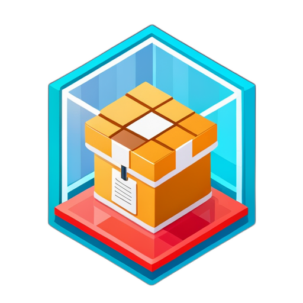

# What is this?

A basic [Content Addressable aRchive](https://ipld.io/specs/transport/car/) v1 reader and writer. Enough to get you reading from the [ATProto](https://atproto.com/) firehose and emitting blocks from your own PDS. [More details on ATProto's CAR usage here.](https://atproto.com/specs/repository#car-file-serialization)

## Installation

```bash
pip install carbox
```

## Basic Usage

```python
from datetime import datetime
from carbox.car import Block, read_car, read_event_pair, write_car
import dag_cbor

# Where websocket_msg is a message comes from the firehose.
header, event = read_event_pair(websocket_msg)
roots, blocks = read_car(event['blocks'])
records = [dag_cbor.decode(block) for block in blocks]

record = {
  '$type': 'app.bsky.feed.post',
  'text': 'Hello, world!',
  'createdAt': datetime.now().isoformat(),
}
block = Block(decoded=record)
car_bytes = write_car(block.cid, [block])
```
